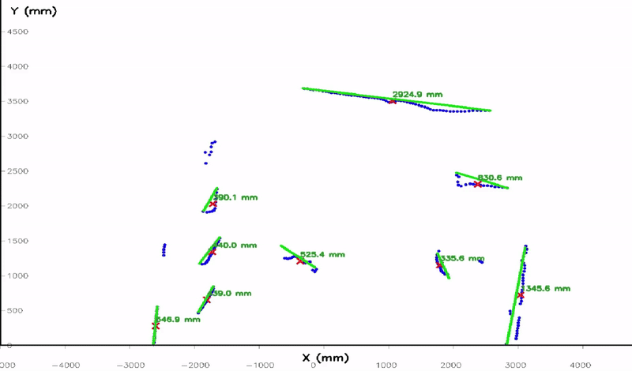
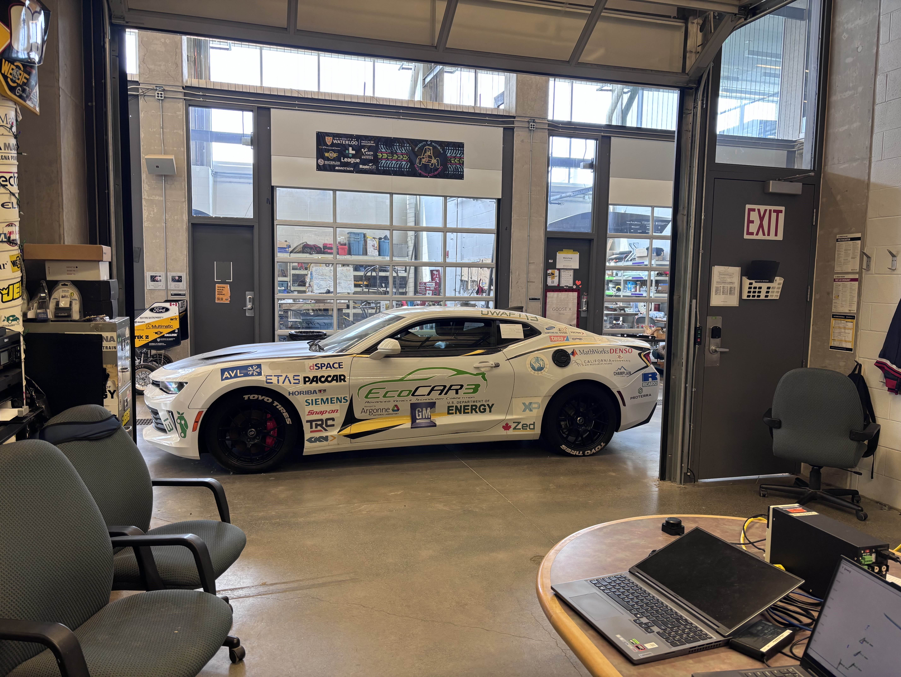

# RPLidarC1-ObjectDetection

---

## Overview
This project implements a **real-time object detection and width estimation system** using the **RPLidar C1 sensor**, **RTMaps**, and the official [RPLidar SDK](https://github.com/Slamtec/rplidar_sdk).  
It processes raw Lidar data, detects objects using **DBSCAN clustering**, calculates object widths with a **sticky width memory algorithm**, and visualizes results in real-time using **OpenCV**.

The system is designed for the **University of Waterloo's Alternative Fuels Team (UWAFT)**, which competes in the **EcoCAR EV Challenge**. A robust and fast object detection algorithm was essential because this LiDAR acts as a **supervisory module within the perception stack**, validating and verifying objects that the stock sensors on the vehicle detect.

---

### Real-time Object Detection in Action

*The LiDAR system detecting dynamic objects (two people moving in the environment) and computing their widths and orientations in real-time.*

---

## Features
- Real-time Lidar data processing from **RPLidar C1**
- Object detection using **DBSCAN clustering**
- **Width estimation** with hysteresis-based "sticky width" memory for stability
- **OpenCV visualization** with:
  - Blue points: Raw detections
  - Red X: Cluster centroids
  - Green lines: Width bounds
  - Axis ticks and labels for scale reference
- Fully integrated with **RTMaps** for time-synchronized data pipelines
- Built on [RPLidar SDK](https://github.com/Slamtec/rplidar_sdk) for robust hardware interfacing

---

## System Architecture

The object detection pipeline consists of the following stages:

1. **Lidar Data Acquisition**
   - RPLidar C1 streams raw angle-distance pairs into RTMaps using C++ to send requests to the LiDAR.

2. **Data Preprocessing**
   - Convert polar coordinates (angle, distance) → Cartesian (x, y).
   - Filter invalid points and apply range limits.

3. **Clustering (Object Detection)**
   - Apply **DBSCAN** to group points into clusters.
   - Compute each cluster's **centroid** (x, y).

4. **Width Estimation**
   - Determine the two farthest points in each cluster.
   - Compute **object width** using Euclidean distance.
   - Apply **sticky width hysteresis** to maintain stable width values over time.

5. **Visualization**
   - Display:
     - **Blue dots:** Raw Lidar points
     - **Red X:** Cluster centroids
     - **Green lines:** Width bounds with labels
   - Rendered using **OpenCV** with axes, ticks, and labels.

---

## Test Environment

*Two participants walked through the LiDAR field of view to simulate dynamic objects for testing the algorithm.*

---

## Dependencies
- [RTMaps 4](https://intempora.com/download/RTMaps4/)
- [RPLidar SDK](https://github.com/Slamtec/rplidar_sdk) – used for interfacing with the RPLidar C1
- Python packages:
  - numpy
  - opencv-python
  - scikit-learn

---

## Usage
1. Connect your **RPLidar C1** to your machine.
2. Launch **RTMaps** and create a scenario with:
   - Lidar Input Component (using RPLidar SDK)
   - `dbscan_cluster.py` → Preprocessing + Clustering
   - `object_memory.py` → Sticky Width Memory
   - `plotting_cv.py` → OpenCV visualization
3. Run the scenario:
   - **Blue points:** Raw Lidar detections
   - **Red X:** Detected object centroids
   - **Green lines:** Object width bounds with labels

## Repository Structure
